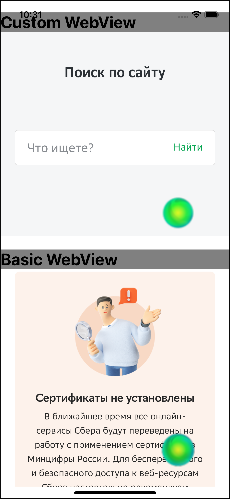

# react-native-webview-with-cert

**iOS only** - _currently_

This is a custom webview that support external certificates in the requests. It needs when you access to resources that rely on unusual root certificate and its chain.

__It is not a fork and not a patch. It is official [React Native WebView](https://github.com/react-native-webview/react-native-webview) with add-on provided by guideline with native module.__
More info here [Android](https://reactnative.dev/docs/custom-webview-android) | [iOS](https://reactnative.dev/docs/0.68/custom-webview-ios). You can do it by your-self directly in your project but if you are too lazy for that you can take this package :).
## Installation

```sh
yarn add react-native-webview-with-cert
```

## Configuring
Before usage you need to link binary your certs.
Generate `.der` certificates (root and sub). Put it into your project root folder with following names
- certificate.der
- certificate_sub.der

These files must be boundled (included in the output application file), so don't forget to mark checkbox with copy etc.
Now you are ready to use it.

## Usage
As it is common WebView component it has the same props, so please check official doc [here](https://github.com/react-native-webview/react-native-webview#usage)

```js
import { WebviewWithCertView } from "react-native-webview-with-cert";

// ...

<WebviewWithCertView source={{ uri: 'https://specificdomain.com/' }} />
```

Access to specific URL (which is available under custom root certificate) and see the result
As you can see in example simle WebView (bottom one) - has notice that certificates are not installed. Top one - has loaded a website in normal scenario.

P.S. _Sorry for SafeArea broken layout_



## Contributing

See the [contributing guide](CONTRIBUTING.md) to learn how to contribute to the repository and the development workflow.

## License

MIT

---

Made with [create-react-native-library](https://github.com/callstack/react-native-builder-bob)
